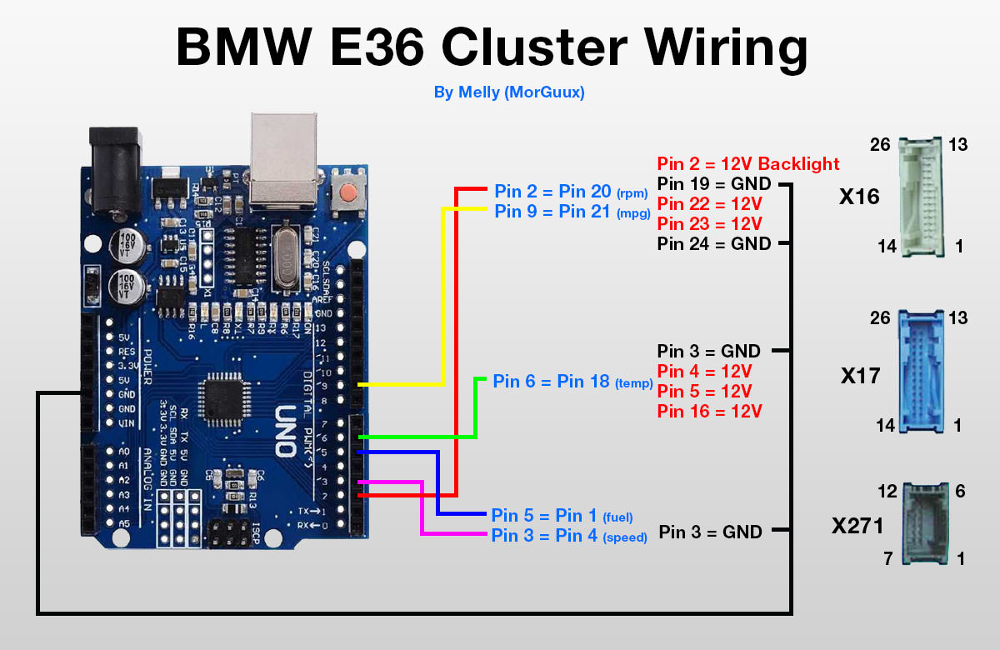
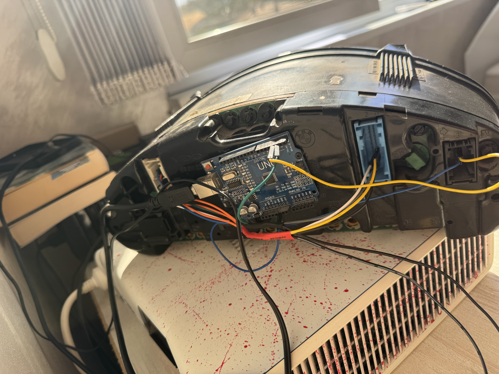

# BMW E36 Табло Демо с Arduino Uno R3

Този проект демонстрира как да се свърже оригинално табло от BMW E36 с Arduino Uno R3 и да се симулира реалистично каране. Проектът генерира точни сигнали за оборотомера и километража, които са калибрирани според оригиналните BMW E36 спецификации.

## Характеристики

- **Реалистична симулация на каране** - пълен цикъл от стартиране на двигателя до спиране
- **Автентични BMW E36 спецификации**:
  - Оборотомер: 3 импулса на оборот на двигателя (6-цилиндров двигател)
  - Километраж: 9 импулса на оборот на диференциала
- **Плавни преходи** с реалистично ускорение и забавяне
- **Симулация на скоростни степени** с намаляване на оборотите при превключване
- **Калибрационни фактори** за точно настройване според конкретното табло
- **Пълен демо цикъл** от 100 секунди с различни фази на каране

## Хардуерни Изисквания

- Arduino Uno R3
- BMW E36 инструментално табло
- Свързващи проводници
- 12V захранване за таблото

## Свързване

**Важно**: Този проект използва само сигналите за оборотомер и километраж. Не са необходими свързвания за температура и гориво.


*Диаграма на свързванията - Кредит: Melly (MorGuux)*

## 📸 Проектът в Действие


*Видео демонстрация на работещото табло - показва плавни промени в оборотомера и километража*


*Arduino Uno R3 свързан към BMW E36 таблото*


## Технически Детайли

### Симулирани Датчици

Проектът симулира два основни датчика на BMW E36:

#### 1. Датчик за Обороти на Двигателя 
- **Arduino Pin 2** → генерира 12V импулсни сигнали за оборотомера
- **Спецификация**: 3 импулса на оборот на двигателя (6-цилиндров двигател)
- **Как работи**: За всеки оборот на коляновия вал, датчикът генерира 3 импулса

#### 2. Датчик за Скорост (VSS - Vehicle Speed Sensor) 
- **Arduino Pin 3** → генерира 12V импулсни сигнали за километража
- **Спецификация**: 9 импулса на оборот на диференциала
- **Как работи**: Датчикът на диференциала засича оборотите на изходящия вал

### BMW E36 Спецификации

Проектът е разработен с точните технически характеристики на BMW E36:

```cpp
const float PULSES_PER_ENGINE_REV = 3.0;    // 6-цилиндров = 3 импулса на оборот
const float PULSES_PER_DIFF_REV = 9.0;      // Сензор на диференциала = 9 импулса на оборот
const float TIRE_CIRCUMFERENCE = 1.88;      // метра (типично за E36 205/60R15)
const float FINAL_DRIVE_RATIO = 3.15;       // Типично съотношение на задния диференциал за E36
```

### Калибрационни Фактори

За точно настройване според конкретното табло:

```cpp
const float RPM_CALIBRATION_FACTOR = 1.2;   // Увеличава честотата на оборотомера
const float SPEED_CALIBRATION_FACTOR = 1.5; // Увеличава честотата на километража
```

## Как Работи Кодът

### Генериране на Импулси

Проектът генерира прецизни импулсни сигнали:

```cpp
// Изчисляване на интервала между импулсите за оборотомера
float rpmFreq = (currentRPM / 60.0) * PULSES_PER_ENGINE_REV * RPM_CALIBRATION_FACTOR;
rpmPulseInterval = (unsigned long)(500000.0 / rpmFreq);

// Изчисляване на интервала между импулсите за километража
float metersPerSecond = currentSpeed / 3.6;
float diffRevsPerSecond = metersPerSecond / TIRE_CIRCUMFERENCE;
float speedFreq = diffRevsPerSecond * PULSES_PER_DIFF_REV * SPEED_CALIBRATION_FACTOR;
speedPulseInterval = (unsigned long)(500000.0 / speedFreq);
```

### Плавни Преходи

Системата използва контролирани промени за реалистично поведение:

```cpp
// Плавно ускорение/забавяне
if (abs(speedDiff) > 0.5) {
    currentSpeed += (speedDiff > 0) ? 0.8 : -1.2;  // Забавянето е по-бързо
}

// Плавна промяна на оборотите
if (abs(rpmDiff) > 20) {
    currentRPM += (rpmDiff > 0) ? 25 : -40;  // Оборотите се променят по-бързо от скоростта
}
```

## 🔄 Инсталация и Използване

1. **Свържете хардуера** според диаграмата по-горе
2. **Заредете кода** в Arduino IDE
3. **Качете скеча** на Arduino Uno R3
4. **Включете 12V захранването** на таблото
5. **Наблюдавайте демото** в Serial Monitor (9600 baud)

### Serial Monitor Изход

Кодът предоставя подробна информация в реално време:

```
BMW E36 Cluster - Complete Working Demo
Using proper BMW specifications:
- RPM: 3 pulses per engine revolution
- Speed: 9 pulses per differential revolution
- Smooth realistic acceleration/deceleration

Target - RPM: 2500, Speed: 65 km/h | Actual frequencies - RPM: 125.0 Hz, Speed: 45.2 Hz
```

## ⚙️ Настройка и Калибриране

Ако таблото не показва точни стойности, коригирайте калибрационните фактори:

```cpp
// Увеличете за по-високи показания на оборотомера
const float RPM_CALIBRATION_FACTOR = 1.2;   

// Увеличете за по-високи показания на километража  
const float SPEED_CALIBRATION_FACTOR = 1.5; 
```

---

## Лиценз

Този проект е лицензиран под MIT License - вижте [LICENSE](LICENSE) файла за детайли.

**Кредити**: Диаграма на свързванията - Melly (MorGuux)

**Проект разработен с Arduino IDE**
