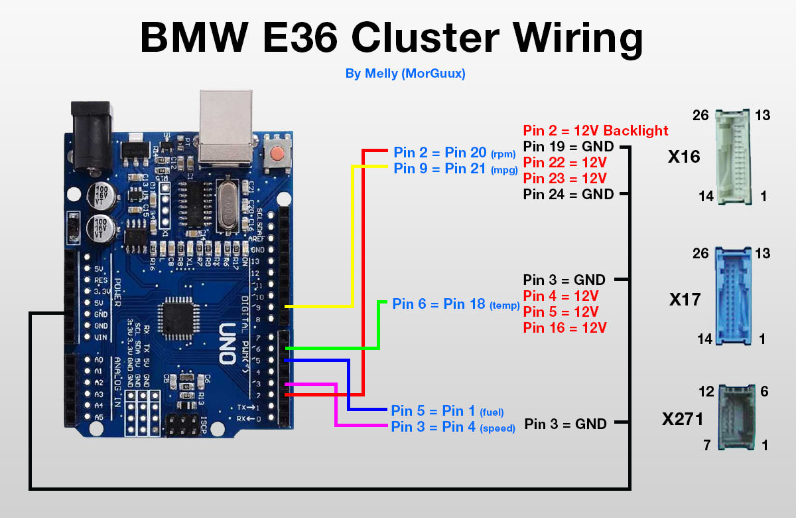

# BMW E36 Cluster Demo with Arduino Uno R3

This project demonstrates how to connect an original BMW E36 instrument cluster to Arduino Uno R3 and simulate realistic driving. The project generates precise signals for the tachometer and speedometer, calibrated according to original BMW E36 specifications.

## Features

- **Realistic driving simulation** - complete cycle from engine start to stop
- **Authentic BMW E36 specifications**:
  - Tachometer: 3 pulses per engine revolution (6-cylinder engine)
  - Speedometer: 9 pulses per differential revolution
- **Smooth transitions** with realistic acceleration and deceleration
- **Gear shift simulation** with RPM drops during shifts
- **Calibration factors** for precise adjustment to specific clusters
- **Complete demo cycle** of 100 seconds with different driving phases

## Hardware Requirements

- Arduino Uno R3
- BMW E36 instrument cluster
- Connecting wires
- 12V power supply for the cluster

## Wiring

**Important**: This project uses only the tachometer and speedometer signals. Temperature and fuel connections are not required.


*Wiring diagram - Credit: Melly (MorGuux)*

## Project in Action


*Video demonstration of the working cluster - shows smooth changes in tachometer and speedometer*


*Arduino Uno R3 connected to BMW E36 cluster*

## Technical Details

### Simulated Sensors

The project simulates two main BMW E36 sensors:

#### 1. Engine RPM Sensor (Tachometer)
- **Arduino Pin 2** → generates 12V pulse signals for tachometer
- **Specification**: 3 pulses per engine revolution (6-cylinder engine)
- **How it works**: For every crankshaft revolution, the sensor generates 3 pulses

#### 2. Vehicle Speed Sensor (VSS)
- **Arduino Pin 3** → generates 12V pulse signals for speedometer
- **Specification**: 9 pulses per differential revolution
- **How it works**: Differential sensor detects output shaft revolutions

### BMW E36 Specifications

The project uses authentic BMW E36 technical characteristics:

```cpp
const float PULSES_PER_ENGINE_REV = 3.0;    // 6-cylinder = 3 pulses per revolution
const float PULSES_PER_DIFF_REV = 9.0;      // Differential sensor = 9 pulses per rev
const float TIRE_CIRCUMFERENCE = 1.88;      // meters (typical for E36 205/60R15)
const float FINAL_DRIVE_RATIO = 3.15;       // Typical E36 rear diff ratio
```

### Calibration Factors

For precise adjustment according to specific cluster:

```cpp
const float RPM_CALIBRATION_FACTOR = 1.2;   // Increases calculated RPM frequency
const float SPEED_CALIBRATION_FACTOR = 1.5; // Increases calculated speed frequency
```

## How the Code Works

### Pulse Generation

The project generates precise pulse signals:

```cpp
// Calculate RPM pulse interval
float rpmFreq = (currentRPM / 60.0) * PULSES_PER_ENGINE_REV * RPM_CALIBRATION_FACTOR;
rpmPulseInterval = (unsigned long)(500000.0 / rpmFreq);

// Calculate speed pulse interval
float metersPerSecond = currentSpeed / 3.6;
float diffRevsPerSecond = metersPerSecond / TIRE_CIRCUMFERENCE;
float speedFreq = diffRevsPerSecond * PULSES_PER_DIFF_REV * SPEED_CALIBRATION_FACTOR;
speedPulseInterval = (unsigned long)(500000.0 / speedFreq);
```

### Smooth Transitions

The system uses controlled changes for realistic behavior:

```cpp
// Smooth acceleration/deceleration
if (abs(speedDiff) > 0.5) {
    currentSpeed += (speedDiff > 0) ? 0.8 : -1.2;  // Deceleration is faster
}

// Smooth RPM changes
if (abs(rpmDiff) > 20) {
    currentRPM += (rpmDiff > 0) ? 25 : -40;  // RPM changes faster than speed
}
```

## Installation and Usage

1. **Connect hardware** according to the diagram above
2. **Load the code** in Arduino IDE
3. **Upload the sketch** to Arduino Uno R3
4. **Power on the 12V supply** for the cluster
5. **Monitor the demo** in Serial Monitor (9600 baud)

### Serial Monitor Output

The code provides detailed real-time information:

```
BMW E36 Cluster - Complete Working Demo
Using proper BMW specifications:
- RPM: 3 pulses per engine revolution
- Speed: 9 pulses per differential revolution
- Smooth realistic acceleration/deceleration

Target - RPM: 2500, Speed: 65 km/h | Actual frequencies - RPM: 125.0 Hz, Speed: 45.2 Hz
```

## Setup and Calibration

If the cluster doesn't show accurate values, adjust the calibration factors:

```cpp
// Increase for higher tachometer readings
const float RPM_CALIBRATION_FACTOR = 1.2;   

// Increase for higher speedometer readings
const float SPEED_CALIBRATION_FACTOR = 1.5; 
```

## Development and Testing

The project was developed through an iterative process:

1. **Research BMW E36 specifications** - determining exact pulses for 6-cylinder engine
2. **Analyze cluster signals** - understanding expected frequencies
3. **Create realistic simulation** - modeling actual driving scenarios
4. **Optimize smoothness** - avoiding abrupt changes in readings
5. **Calibrate factors** - fine-tuning for specific cluster

## Technical Advantages

- **Standalone project** - works independently without additional software
- **Optimized algorithms** - uses microsecond precision for smooth signals
- **Realistic transitions** - simulates actual driving and shifting patterns
- **Easy adjustment** - calibration factors for different clusters
- **Detailed logging** - complete information for debugging

## Troubleshooting

### Cluster not responding
- Check 12V power supply
- Verify connections according to diagram
- Increase calibration factors

### Inaccurate readings
- Adjust `RPM_CALIBRATION_FACTOR` and `SPEED_CALIBRATION_FACTOR`
- Check Serial Monitor for actual frequencies
- Ensure wires are properly connected

### Abrupt changes in readings
- Algorithm already includes smooth transitions
- If needed, reduce change steps in `smoothTransitions()`

## Notes

- Minimum speed is set to 20 km/h for proper cluster operation
- Maximum RPM is limited to 7000 RPM for safety
- Demo cycle repeats automatically every 100 seconds
- Code is optimized for smoothness and realism

---

## License

This project is licensed under the MIT License - see the [LICENSE](LICENSE) file for details.

**Credits**: Wiring diagram - Melly (MorGuux)

**Project developed with Arduino IDE**
